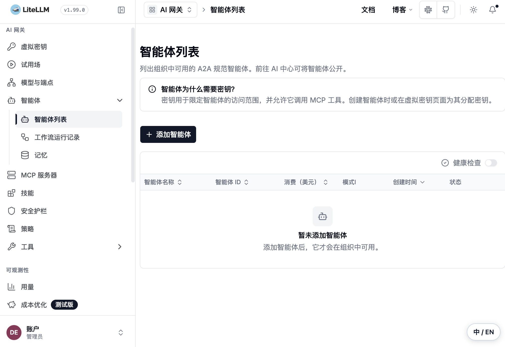

# LiteLLM WebUI 简体中文补丁

[](https://github.com/leonathan369-droid/litellm-ui-zh/actions/workflows/verify.yml)
[](https://github.com/leonathan369-droid/litellm-ui-zh/releases)

为 [LiteLLM](https://github.com/BerriAI/litellm) Proxy WebUI 提供简体中文
浏览器端翻译覆盖层。它复制 LiteLLM 自带的静态 UI 到单独目录后注入翻译脚本，并在
右下角提供 `中 / EN` 切换。This is an unofficial Simplified Chinese overlay,
not a LiteLLM fork.

如果这个项目对你有帮助，欢迎点个 Star。有意见、翻译建议或版本兼容性问题，欢迎通过
[Issue](https://github.com/leonathan369-droid/litellm-ui-zh/issues) 反馈。

## 适合谁

- 个人自部署 LiteLLM，想在不修改安装包的前提下使用中文界面。
- 团队网关管理员，需要可验证、可回退的自定义 UI 目录，而不是修改线上代理逻辑。

## 三项保证

- 不修改 LiteLLM Python 安装包。
- 不改变 Proxy API、模型路由、数据库、密钥或计费行为。
- 自定义 UI 可通过 `check` 校验；`restore` 会保留原补丁目录作为恢复副本。

## 快速安装

前提：已单独安装 LiteLLM，且启动 LiteLLM 的 Python 环境中包含
`litellm/proxy/_experimental/out` 静态 UI。

```zsh
git clone https://github.com/leonathan369-droid/litellm-ui-zh.git
cd litellm-ui-zh
python3 scripts/install.py install \
  --target "$HOME/.config/litellm/ui-zh"
```

让启动 LiteLLM 的同一环境使用该 UI 目录，随后重启 LiteLLM：

```zsh
export LITELLM_UI_PATH="$HOME/.config/litellm/ui-zh"
litellm --host 127.0.0.1 --port 4000
```

如果 LiteLLM 装在另一个虚拟环境，使用它自己的 Python 来定位原始 UI：

```zsh
python3 scripts/install.py install \
  --python /path/to/litellm-venv/bin/python \
  --target "$HOME/.config/litellm/ui-zh"
```

macOS `launchd`、环境变量和回退说明见 [macOS 部署说明](docs/macos.md)。不要把
API Key、`MASTER_KEY`、数据库 URL 或完整环境文件放入启动命令、Issue 或截图。

## 预期结果与校验

打开 LiteLLM WebUI 后，常见管理界面文本会显示为简体中文；右下角 `中 / EN` 按钮可
随时切回英文。修改不会影响 API 请求。

### 界面预览

下图为 LiteLLM `1.99.0` 的真实空状态界面，未包含密钥、请求内容、用量、日志或
业务数据。



重启后运行校验：

```zsh
python3 scripts/install.py check --target "$HOME/.config/litellm/ui-zh"
```

已安装目录中的所有 HTML 路由都会检查翻译脚本注入与校验和。当前没有安全的已登录
控制台截图可公开；确认无密钥、用户数据、请求内容、日志和用量信息后会补充真实预览。

## 回退

如需恢复自定义目录内的原始 LiteLLM UI：

```zsh
python3 scripts/install.py restore --target "$HOME/.config/litellm/ui-zh"
```

`restore` 会将已补丁目录保留为同级恢复备份。若只想回到 LiteLLM 包内 WebUI，移除
`LITELLM_UI_PATH` 后重启 LiteLLM 即可。

## 兼容性矩阵

| LiteLLM | 系统 | 验证日期 | 安装器 | 浏览器界面 |
| --- | --- | --- | --- | --- |
| 1.99.0 | macOS | 2026-09-03 | installer + check passed | browser UI manually checked |

尚未验证 Linux 或 Windows。升级 LiteLLM 前保留当前 UI 目录；升级后重新运行安装器或
`check`，并检查你常用的 WebUI 路由。

## 团队管理员说明

将 `LITELLM_UI_PATH` 放在实际启动 LiteLLM 的服务环境中，而不是用户交互 Shell 中。
先在测试实例对目标 LiteLLM 版本运行安装和 `check`，确认关键路由后再切换生产服务。
如需撤回，移除该环境变量或将它指回已验证的 UI 目录，再重启服务。不要通过补丁目录
保存生产配置、密钥、数据库连接或日志。

## 常见问题

| 现象 | 处理方式 |
| --- | --- |
| `litellm is not installed` | 用 `--python /path/to/litellm-venv/bin/python` 指向实际 LiteLLM 环境。 |
| 目标目录已存在 | 选择一个新的目录进行安装；不要覆盖正在使用的 UI 目录。 |
| 页面仍是英文或部分文本未翻译 | 先运行 `check`；确认服务实际使用了 `LITELLM_UI_PATH`，再提交翻译 Issue。 |
| LiteLLM 升级后页面异常 | 在测试环境重新安装并检查路由；提交兼容性报告，不要把生产配置贴到 Issue。 |

## 支持与贡献

- [支持和安全报错说明](SUPPORT.md)
- [贡献指南](CONTRIBUTING.md)
- [更新记录](CHANGELOG.md)
- [LiteLLM 上游项目](https://github.com/BerriAI/litellm)
- [许可证](LICENSE)

本仓库仅分发翻译覆盖层和安装器，不包含 LiteLLM 源码、原始 WebUI 静态包、服务商
Logo、配置或凭据。详细归属见 [NOTICE.md](NOTICE.md)。
